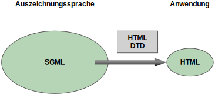

# Chapter 1: Basic Formatting
  
## Enumerations

  * Level 1
  * Level 1 with _highlight_ or new __term__ or *alternate highlight* or alternate **term**
    * Level 2 with<br>Linebreak
    * Level 2
  * Level 1 again with<br>[Link](http://www.google.com)

---
Explanation not shown on the slide directly goes here. It can again contain all elements usable on the slide like enumerations, images, tables etc.

  * Item 1
  * Item 2
    * Item 3
    * Item 4

## Image

/60%//30%/

```console
/60%//30%/
```

  * First percentage indicates size in presentation
  * Second percentage indicates size in plain document


## Table

HTML Versions

| Version   | Datum  | Features                                       |
|-----------|--------|------------------------------------------------|
| HTML 2.0  | Nov 95 | RFC 1866                                       |
| HTML 3.2  | Mai 96 | Tabellen, Datei-Upload, physische Formatierung |
| HTML 4.0  | Jan 98 | Frames, CSS, Skript                            |
| HTML 4.01 | Dez 99 | minimale Korrekturen zu HTML 4.0               |
| XHTML 1.0 | Jan 00 | Recommendation                                 |
| XHTML 1.1 | Nov 10 | Recommend. 2nd Ed.                             |
| HTML5     | Mai 11 | Working Draft                                  |

## Mathematical Typesetting

Latex formula can be directly embedded (requires [MathJax](http://www.mathjax.org/) to be included into the project if HTML slides are generated. LaTeX slides will handle formula automatically.)

\[
\sum_{i=0}^N{P(X = i)} = 1
\]
